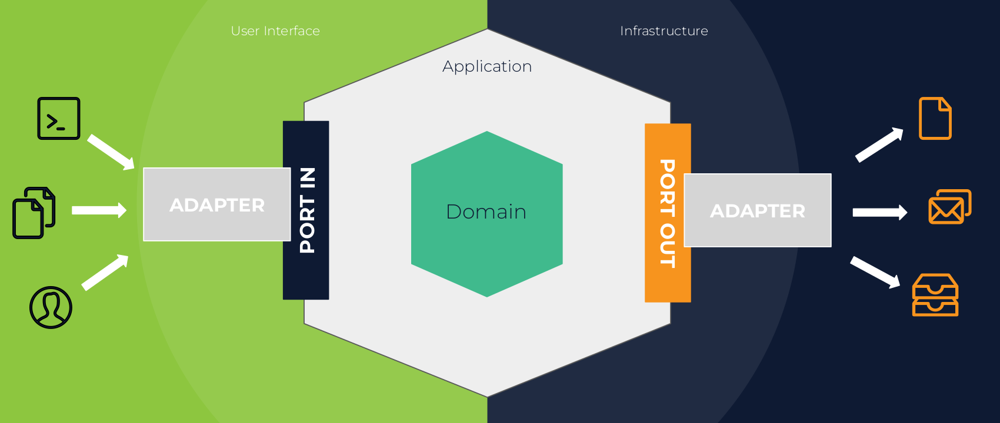

# Hexagonal Architecture Example
This project was designed for educational purposes to understand the concepts and implementation of hexagonal architecture.

## Prerequisites
- JDK 11
- Maven
- Docker
- Docker-compose

## How to Run 

This application is packaged as a war which has Tomcat 8 embedded. No Tomcat or JBoss installation is necessary. You run it using the ```java -jar``` command.

* Clone this repository 
* This project depends on a database, run ```docker-compose up``` in  the project root directory to start postgresql container. 
* Once the container is running, you can build the project and run the tests by running ```mvn clean install```
* Once successfully built, you can run the service by one of these two methods:
```
        java -jar -Dspring.profiles.active=test target/arquitetura-hexagonal-0.0.1-SNAPSHOT.jar
or
        mvn spring-boot:run -Drun.arguments="spring.profiles.active=test"
```

Once the application runs you should see something like this

```
2022-10-17 08:03:10.346  INFO 23900 --- [           main] o.s.b.w.embedded.tomcat.TomcatWebServer  : Tomcat started on port(s): 8080 (http) with context path ''
2022-10-17 08:03:10.376  INFO 23900 --- [           main] c.m.a.ArquiteturaHexagonalApplication    : Started ArquiteturaHexagonalApplication in 3.343 seconds (JVM running for 4.055)
```

## About the Service

The service is just a simple user favorite tv show/movie REST service. It uses a postgresql database to store the data, and it has an integration with OMDB API.

Here are some endpoints you can call:

### Create an user associated with his/her favorite movie or tv show
```
POST /users
Accept: application/json
Content-Type: application/json
{
    "name": "Mônica Ribeiro",
    "favoriteMovieTitle": "Friends"
}

RESPONSE: HTTP 201 (Created)
{
    "id": 1,
    "name": "Mônica Ribeiro",
    "favoriteMovie": {
        "imdbID": "tt0108778",
        "title": "Friends",
        "poster": "https://m.media-amazon.com/images/M/MV5BNDVkYjU0MzctMWRmZi00NTkxLTgwZWEtOWVhYjZlYjllYmU4XkEyXkFqcGdeQXVyNTA4NzY1MzY@._V1_SX300.jpg"
    }
}
```

### Find user by id
```
POST /users/{id}
Accept: application/json
Content-Type: application/json

RESPONSE: HTTP 200 (OK)
{
    "id": 1,
    "name": "Mônica Ribeiro",
    "favoriteMovie": {
        "imdbID": "tt0108778",
        "title": "Friends",
        "poster": "https://m.media-amazon.com/images/M/MV5BNDVkYjU0MzctMWRmZi00NTkxLTgwZWEtOWVhYjZlYjllYmU4XkEyXkFqcGdeQXVyNTA4NzY1MzY@._V1_SX300.jpg"
    }
}
```

## What is Hexagonal Architecture?

It is an architecture proposed by Alistair Cockburn, which was initially called Ports And Adapters.

This is a layered architecture proposal, as well as others, in order to **protect the business logic**. The difference is that Allistar understood that there wasn't much difference between how the user interface and the database interacted with the application, that both were _external items that could be swapped out at any time_.

With that, he proposes **ports**, which are interfaces (applying the dependency inversion principle) that our business logic will know in order to mitigate the direct dependence on external factors (user interface, databases, integrations, queues...). And, the second point that he proposed was the **adapters**, which are the implementation of these ports with the external dependencies.

An image that represents this concept is:




## How is this project organized?

```
├── src
│   ├── main
│   │   ├── java
│   │   │   └── com
│   │   │       └── monicaribeiro
│   │   │           └── arquiteturahexagonal
│   │   │               ├── adapter
│   │   │               │   ├── inbound
│   │   │               │   │   └── controller
│   │   │               │   │       ├── request
│   │   │               │   │       │   └── CreateUserRequest.java
│   │   │               │   │       ├── response
│   │   │               │   │       │   ├── MovieResponse.java
│   │   │               │   │       │   └── UserResponse.java
│   │   │               │   │       └── UserController.java
│   │   │               │   └── outbound
│   │   │               │       ├── integration
│   │   │               │       │   ├── FindMovieAdapter.java
│   │   │               │       │   ├── OmdbClient.java
│   │   │               │       │   └── OmdbMovieResponse.java
│   │   │               │       └── repository
│   │   │               │           ├── GetUserByIdAdapter.java
│   │   │               │           ├── SaveUserAdapter.java
│   │   │               │           ├── UserEntity.java
│   │   │               │           └── UserRepository.java
│   │   │               ├── ArquiteturaHexagonalApplication.java
│   │   │               ├── config
│   │   │               │   ├── BeanConfig.java
│   │   │               │   └── exception
│   │   │               │       ├── ApiErrorMessage.java
│   │   │               │       ├── CustomExceptionHandler.java
│   │   │               │       └── UserNotFoundException.java
│   │   │               └── domain
│   │   │                   ├── domain
│   │   │                   │   ├── Movie.java
│   │   │                   │   └── User.java
│   │   │                   ├── ports
│   │   │                   │   ├── inbound
│   │   │                   │   │   ├── CreateUserUseCasePort.java
│   │   │                   │   │   └── GetUserByIdUseCasePort.java
│   │   │                   │   └── outbound
│   │   │                   │       ├── FindMovieAdapterPort.java
│   │   │                   │       ├── GetUserByIdAdapterPort.java
│   │   │                   │       └── SaveUserAdapterPort.java
│   │   │                   └── usecase
│   │   │                       ├── CreateUserUseCase.java
│   │   │                       └── GetUserByIdUseCase.java
```

#### Adapters 
They are the implementation of your external dependencies (user interface/inbound and infrastructure/outbound)
- `adapter/inbound`: this is where all our controllers are.
- `adapter/outbound`: this is where all our external integrations are (repository, API integration etc).

#### Domain
Here we have all our classes that don't have any dependency, including framework dependencies.
- `domain/domain`: this is where all domains are.
- `domain/ports/inbound`: this is where our interfaces that represents our use cases are.
- `domain/ports/outbound`: this is where our interfaces that represents external services are. Note that here we do not have any naming connected to the technologies.
- `domain/usecase`: this is where the implementation of the usecases are.

## Considerations
This is an example of how to implement the structure of the hexagonal architecture. 

Your biggest concern should be to make good use of the concepts of ports and adapters, which is fully connected with the inversion of dependencies. Furthermore, it is important to respect the fact that your usecases, interfaces (ports) and domains must not have any external dependencies (including with the framework).

The idea is that your business rule is fully protected from these external factors.

## Presentations about it

- [Video: Alistair in the "Hexagone" 1/3](https://www.youtube.com/watch?v=th4AgBcrEHA&ab_channel=DDDFR)
- [Article: Hexagonal architecture](https://alistair.cockburn.us/hexagonal-architecture/)
- [PT/BR Video: Arquitetura Hexagonal com Mônica Ribeiro | Zup Tech Hour ⌚](https://www.youtube.com/watch?v=fpVm2NbZVJw&ab_channel=Zup)
- [PT/BR Video: Vale a pena utilizar arquitetura hexagonal?](https://www.youtube.com/watch?v=59ecdfC31Nk&ab_channel=WoMakersCode)


